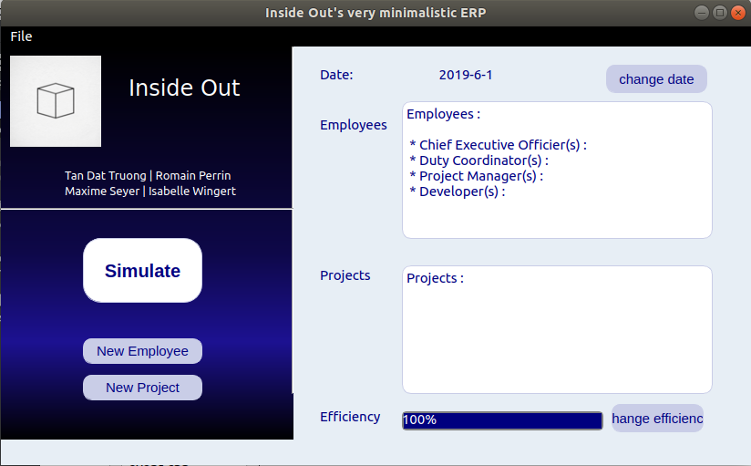
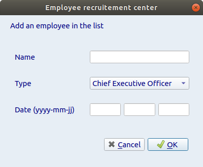
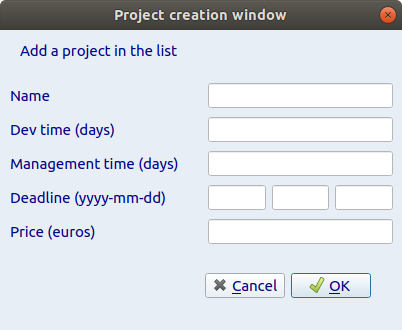

# Projet de l'UE "Qualité et ERP"

## Equipe de développement

- Romain Perrin
- Maxime Seyer
- Tan Dat Truong
- Isabelle Wingert

## Hypothèses simplificatrices

- Nous choisissons de prendre les projets se terminant les plus tôt en premiers.
- Non prise en compte des jours fériés
- Prise en compte des week-end
- Non simulation des maladies (chaque employé travaille exactement 5 jours par semaine)
- Non simulation de l'humeur (l'efficience reste constante)
- Non prise en compte des congés payés
- Il y a toujours au moins un projet actif
- L'outil a été conçu en ayant à l'esprit la feuille de style des ERP des années 80, d'ou son design retro.

## Conventions de nommage

- Langue: **Anglais**
- Nom des fichers: **snake\_case**
- Fichiers source: dossier **src**
- Fichiers header: dossier **include**
- Documentation: dossier **doc**
- Fichiers librairies: dossier **lib**
- Noms de variable: **snake\_case**

## Compilation et lancement de l'ERP

Il faut ouvrir le .pro avec qtcreator, le compiler et le lancer.

## Déroulement d'une simulation

Voici l'interface qui s'affiche lors du lancement de l'ERP:

On peut:

- Charger un fichier qui contient au préalable l'ensemble des informations nécessaires à la simulation dans la barre déroulante

Puis, au besoin:

- Ajouter des membres d'équipe

- Ajouter des projets

Une fois l'ensemble des données entrées, on lance la simulation et les résultats s'affichent dans une nouvelle fenêtre.

Ces résultats contiennent seulement à la question principale: est-ce que les projets sont faisables dans les délais impartis avec les ressources à disposition, et dans le cas contraire, les resssources supplémentaires nécessaires. Pour le détail des évènements, on pourra se reporter au log généré dans le répertoire d'éxecution.

Dans le dossier **test**, plusieurs simulations ont été effectuées, et un comparatif des résultats obtenus à l'aide de l'ERP par rapport aux résultats attendus (calculés à la main). On y trouve également un fichier log obtenu en sortie du programme pour chaque simulation.

* [simulation 1](./test/grille_01.md)
  * [log simulation 1](./test/results_01)
* [simulation 2](./test/grille_02.md)
  * [log simulation 2](./test/results_02)
* [simulation 3](./test/grille_03.md)
  * [log simulation 3](./test/results_03)
* [simulation 4](./test/grille_04.md)
  * [log simulation 4](./test/results_04)

## Résumé de l'algorithme:

L'algorithme principal se trouve dans le fichier mainwindow.cpp, la gestion des évènements (la liste des projets ainsi que la liste des projets) est réalisée à l'aide d'une pile.

Pour le calcul du nombre de jours de travail:

nombre de jours par dev = nombre de jour de dev du projet / nombre de dev

nombre de jours par manager = nombre de jours de management / nombre de jours de management

Pour de plus amples informations, se reporter au code commenté dans le fichier correspondant.

**Toute faille est totalement volontaire et entièrement maîtrisée et testée**